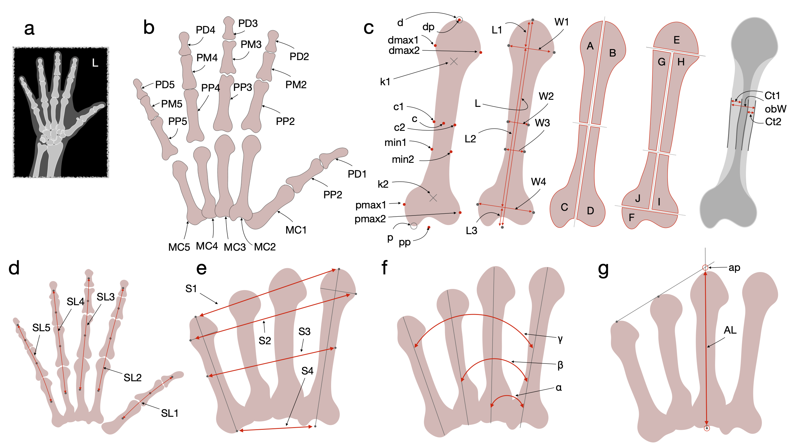

# Morphometric-Bone2Gene

Hand Radiograph Morphometric Analysis

**Repository for the code accompanying the paper:**  
*Novel morphometric features in hand radiographs for diagnostic applications*  
**Authors:** Philipp Schmidt, *et al.*  
**Preprint (Research Square):** TBA  
**License:** Creative Commons Attribution-NonCommercial 4.0 International (CC BY-NC 4.0). Commercial use requires explicit permission from the authors. 

This GitHub repository provides a framework for the analysis of segmented hand radiographs and the extraction of morphometric features from 19 phalangeal and metacarpal bones, based on published formulas.

The framework enables standardized statistical and machine-learning–based analysis of hand morphology and is designed to be modular and extensible.

## Repository Overview

The repository consists of three main Python programs:

1. main_analysis.py

Main analysis pipeline for feature extraction, normalization, and evaluation.
This script relies on multiple helper modules located in the lib/ directory and performs the following steps:

Feature Computation
Calculates morphometric measurements according to formulas described in the referenced publication.

Metadata Integration
Incorporates age and sex information from a provided annotation file.

Statistical Analysis
Computes the mean and standard deviation for each extracted feature.

Normalization
Calculates z-scores for all features using a user-defined reference population.

Meta-Classification
Combines multiple classifiers into a multiclass soft-majority meta-classifier.

High-Dimensional Metric
Computes a distance-based metric (“Radius”) in feature space derived from the z-scores.

2. SVM Training (One-vs-One and One-vs-Rest)

This Python program trains Support Vector Machine (SVM) classifiers for all possible:

One-vs-One classification scenarios

One-vs-Rest classification scenarios

The trained models can be used independently or integrated into the meta-classification framework.

3. Reference CSV Creation

Python script for generating a reference CSV file based on a healthy reference dataset.

Aggregates morphometric features from healthy subjects

Creates a reference table suitable for
main_analysis.py / create_z_score_3_year_bins.py

Supports age-dependent reference populations (e.g., 3-year age bins)

Purpose and Scope

This framework enables:

Standardized morphometric analysis of segmented hand radiographs

Comparison of individual measurements against a healthy reference population

Integration of classical statistical analysis with machine learning

Flexible extension with additional features, classifiers, or reference datasets

## License

This project is licensed under the
Creative Commons Attribution-NonCommercial 4.0 International License (CC BY-NC 4.0).

Use of this code, models, or derived works is permitted **for non-commercial
research and educational purposes only**, provided appropriate attribution
is given.

See the LICENSE file for full terms.

## Commercial Use

Commercial use of this repository is **not permitted** under the terms of the
CC BY-NC 4.0 license.

